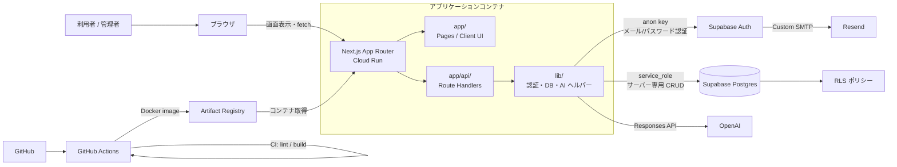
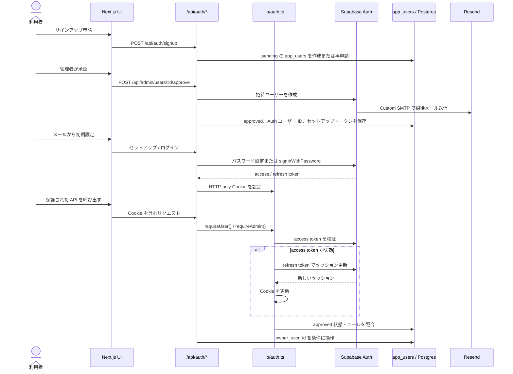
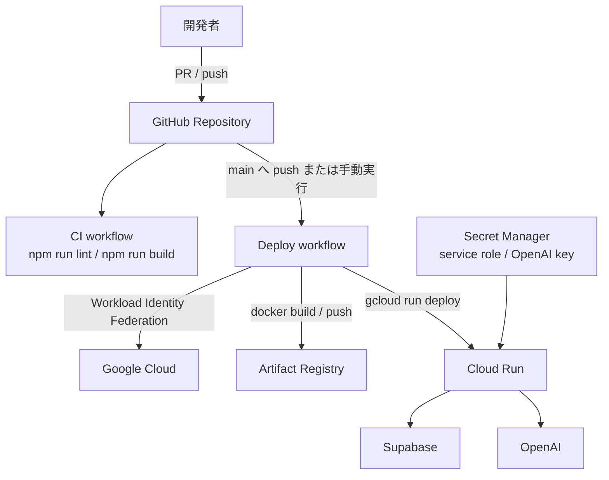

# AI Technical Notes DB アーキテクチャ設計

## 目的と前提

AI Technical Notes DB は、ユーザーごとに技術メモとカテゴリを安全に管理し、OpenAI による分類候補を活用する Web アプリケーションです。アプリケーション本体は Next.js を Cloud Run で稼働させ、認証・データベースは Supabase、メール配送は Supabase Auth の Custom SMTP と Resend を利用します。

このドキュメントは、実装上の責務境界と各プラットフォームの連携を説明します。運用手順は [`DEPLOYMENT.md`](DEPLOYMENT.md)、認証コードの詳細レビュー観点は [`AUTH_REVIEW.md`](AUTH_REVIEW.md) を参照してください。

## システム全体

### コンポーネントと責務

| 層 / サービス | 主な役割 | 主な実装・設定 |
|---|---|---|
| Next.js App Router | 画面ルーティング、React UI、同一オリジンの API 提供 | `app/` |
| Route Handlers | 入力を受け、認証・認可後にメモ、カテゴリ、管理者、AI のユースケースを実行 | `app/api/` |
| lib 層 | Cookie セッション、Supabase クライアント、OpenAI 呼び出し、URL 生成を集約 | `lib/auth.ts`、`lib/supabase-*.ts`、`lib/ai-classification.ts` |
| Supabase Auth | メール/パスワード認証、招待、リカバリ、JWT セッションの発行 | Supabase Auth |
| Supabase Postgres | アプリデータとユーザー承認状態を保持 | `supabase/migrations/` |
| RLS | Postgres の行単位アクセス制御。`owner_user_id` を使ったデータ分離の防御層 | Supabase の RLS ポリシー |
| OpenAI | タイトル、カテゴリ、タグ、分類候補を生成 | Responses API |
| Resend | Supabase Auth が送る招待・リカバリメールの SMTP 配送先 | Supabase Custom SMTP |
| Cloud Run | Next.js コンテナの実行基盤。Secret Manager の値を実行時に注入 | `Dockerfile`、`.github/workflows/deploy.yml` |
| Artifact Registry | GitHub Actions がビルドしたコンテナイメージを保管 | GCP `ai-notes` リポジトリ |
| GitHub Actions | PR / `main` の CI と、`main` への CD を実行 | `.github/workflows/ci.yml`、`.github/workflows/deploy.yml` |

## アプリケーション境界

### UI と API

ページおよびクライアント UI は `app/` にあり、データ更新・検索・認証操作は原則として `app/api/` の Route Handler に送信します。これにより、ブラウザに `SUPABASE_SERVICE_ROLE_KEY` や `OPENAI_API_KEY` を公開せず、認可判定と外部 API 呼び出しをサーバーに閉じ込めます。

主な API 群は次のとおりです。

- `/api/auth/*`: ログイン、サインアップ申請、初期セットアップ、パスワードリセット、現在のユーザー取得
- `/api/notes/*` と `/api/categories/*`: 所有者スコープの CRUD・検索・カテゴリ階層管理
- `/api/ai/*`: OpenAI を使う分類・提案処理
- `/api/admin/users/*`: 申請の承認・却下、管理者によるユーザー管理

`lib/auth.ts` の `requireUser()` と `requireAdmin()` が API の認可境界です。`lib/rate-limit.ts` はログイン、申請、パスワードリセットの入口でブルートフォースを抑制します。現在のレート制限は Cloud Run インスタンス内のメモリに保持されるため、複数インスタンス間では共有されません。

### Supabase とデータ分離

`app_users` は Supabase Auth のユーザー ID、承認状態、表示用 ID、管理者ロールをアプリ固有に管理します。メモ・カテゴリ・AI 分類のデータは `owner_user_id` で所有者を表します。

通常のサーバー CRUD は `lib/supabase-server.ts` の service role クライアントを使うため、RLS をバイパスします。そのため、Route Handler 側で `requireUser()` を通し、全クエリを `owner_user_id` でスコープすることが必須です。RLS は、誤ったクライアント利用や直接アクセスに対する二重防御として有効に保ちます。service role キーは Cloud Run の Secret Manager 経由のみで供給し、ブラウザや `NEXT_PUBLIC_` 変数に置きません。

## 認証・セッションの流れ

セッション Cookie は `httpOnly`、`secure`（本番）、`sameSite=lax` を使用します。パスワードリセットメールも Supabase Auth の recovery 機能から同じ Custom SMTP 経路で配信されます。

## AI 分類の流れ

1. 認証済みの利用者がメモ登録・分類提案を要求します。
2. Route Handler は利用者の所有権を確認し、必要なメモ内容を取得します。
3. `lib/ai-classification.ts` がサーバー上で OpenAI Responses API を呼び出します。
4. 返却した候補を UI に返し、利用者または API が保存を実行します。
5. 保存時は対象メモと分類結果を同じ `owner_user_id` に結び付けます。

OpenAI API キーは Secret Manager から Cloud Run に渡し、ブラウザおよびリポジトリに保存しません。AI 応答は候補であり、認可判断や所有者判定には使いません。

## CI/CD と実行環境

- CI はプルリクエストと `main` への push で lint と production build を検証します。
- CD は `main` への push または手動実行でコンテナをビルドし、Artifact Registry に push 後、Cloud Run を更新します。
- GitHub Actions から GCP への認証は Workload Identity Federation を前提とし、長期サービスアカウントキーを避けます。
- Cloud Run は `SUPABASE_SERVICE_ROLE_KEY` と `OPENAI_API_KEY` を Secret Manager から参照します。`NEXT_PUBLIC_*` の値はビルド時にクライアントへ公開されることを前提に、公開可能な値だけを設定します。

## 主要な設定・運用上の注意

- スキーマ変更は `supabase/migrations/` に追加し、RLS と所有者スコープを同時に見直します。
- 認証、管理者 API、データ API の変更時は [`AUTH_REVIEW.md`](AUTH_REVIEW.md) のレビュー観点を確認します。
- `service_role` は RLS を迂回できる高権限キーです。ログ出力、クライアントバンドル、GitHub Secrets 以外の設定ファイルに含めません。
- 実行時のシークレット名・GCP 権限・初回デプロイ手順は [`DEPLOYMENT.md`](DEPLOYMENT.md) を正とします。
