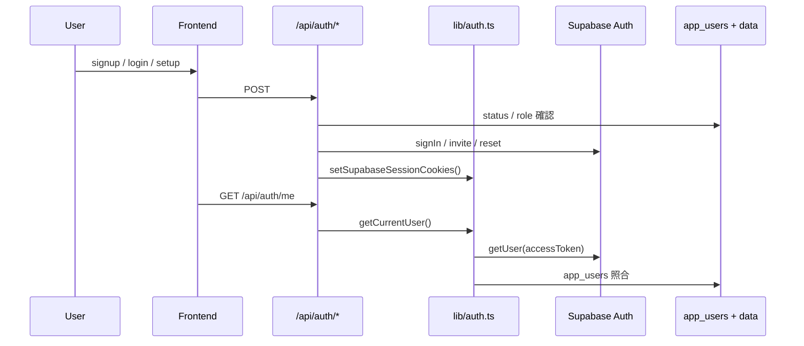

# ユーザー認証コードレビュー

人間レビュアが質問し、Cursor（実装担当 AI）がコード根拠付きで回答するレビュープロセス用ドキュメントです。

## 認証アーキテクチャ（概要）

```text
Supabase Auth（メール/パスワード）
  + app_users テーブル（承認ワークフロー・ロール）
  + HTTP-only Cookie（sb_access_token / sb_refresh_token）
  + API 層の requireUser() / requireAdmin()
  + owner_user_id によるデータ分離
```



---

## 1. 認証関連コード一覧

レビュー対象は **42 ファイル**（直接 35 + 間接 7）です。優先度の高い順に並べています。

### P0: 認証の中核（必読）

| # | ファイル | 役割 | 主要シンボル | レビュー観点 |
|---|---|---|---|---|
| 1 | `lib/auth.ts` | セッション・認可の中心 | `getCurrentUser`, `requireUser`, `requireAdmin`, `setSupabaseSessionCookies`, `hashToken` | Cookie 属性、トークン検証、approved 判定 |
| 2 | `lib/supabase-server.ts` | service_role クライアント | `getSupabaseAdmin` | RLS バイパス、キー管理 |
| 3 | `lib/rate-limit.ts` | 認証 API のレート制限 | `checkRateLimit`, `getClientIp` | ブルートフォース対策、マルチインスタンス |
| 4 | `lib/supabase-auth.ts` | anon key 認証クライアント | `getSupabaseAuthClient` | パスワードリセット専用の分離 |
| 5 | `lib/url.ts` | リダイレクト URL 生成 | `getAppOrigin` | オープンリダイレクト |

### P1: 認証 API（`/api/auth/*`）

| # | ファイル | HTTP | レビュー観点 |
|---|---|---|---|
| 6 | `app/api/auth/login/route.ts` | POST | 承認済みのみログイン、レート制限、列挙防止 |
| 7 | `app/api/auth/logout/route.ts` | POST | セッション無効化の完全性 |
| 8 | `app/api/auth/signup/route.ts` | POST | 申請のみ（Auth 未作成）、列挙防止 |
| 9 | `app/api/auth/me/route.ts` | GET | 現在ユーザー返却 |
| 10 | `app/api/auth/setup/route.ts` | POST | setup token 検証、初回パスワード設定 |
| 11 | `app/api/auth/password-reset/route.ts` | POST | リセットメール要求、列挙防止 |
| 12 | `app/api/auth/password-reset/confirm/route.ts` | POST | 3方式トークン受付、パスワード強度 |
| 13 | `app/api/auth/mfa/route.ts` | POST | 廃止（410）の明示 |

### P1: 管理者 API（`/api/admin/users/*`）

| # | ファイル | HTTP | レビュー観点 |
|---|---|---|---|
| 14 | `app/api/admin/users/route.ts` | GET | requireAdmin |
| 15 | `app/api/admin/users/[id]/route.ts` | DELETE | 自己削除禁止、Auth ユーザー削除 |
| 16 | `app/api/admin/users/[id]/approve/route.ts` | POST | setup token 発行、invite フロー |
| 17 | `app/api/admin/users/[id]/reject/route.ts` | POST | BAN 処理 |
| 18 | `app/api/admin/users/[id]/password-reset/route.ts` | POST | 管理者リセット |
| 19 | `app/api/admin/users/[id]/sign-out/route.ts` | POST | 強制サインアウト（スタブ） |

### P2: 認可付きデータ API（owner スコープ）

| # | ファイル | 認可 |
|---|---|---|
| 20 | `app/api/notes/route.ts` | `requireUser` + `owner_user_id` |
| 21 | `app/api/notes/[id]/route.ts` | 同上 |
| 22 | `app/api/categories/route.ts` | 同上 + 親カテゴリ所有権 |
| 23 | `app/api/categories/[id]/route.ts` | 同上 |
| 24 | `app/api/categories/ensure-path/route.ts` | 同上 |
| 25 | `app/api/ai/classify-notes/route.ts` | 同上 |
| 26 | `app/api/ai/classification-runs/[id]/apply/route.ts` | 同上 |
| 27 | `app/api/ai/suggest-category/route.ts` | 同上 |
| 28 | `lib/ai-classification.ts` | 全 DB クエリに `owner_user_id` |

### P2: フロントエンド（認証 UI・ゲート）

| # | ファイル | 役割 |
|---|---|---|
| 29 | `app/login/page.tsx` | ログイン・リセット開始 |
| 30 | `app/signup/page.tsx` | アカウント申請 |
| 31 | `app/setup/page.tsx` | 初回セットアップ（token クエリ） |
| 32 | `app/reset-password/page.tsx` | パスワード再設定（hash/query トークン） |
| 33 | `app/admin/page.tsx` | 管理者 UI（401/403 処理） |
| 34 | `app/page.tsx` | メイン画面の認証ゲート |
| 35 | `app/categories/page.tsx` | 401 時リダイレクト |

### P3: DB / マイグレーション

| # | ファイル | 内容 |
|---|---|---|
| 36 | `supabase/migrations/20260625090000_add_app_auth_and_user_scoping.sql` | `app_users`、RLS、owner_user_id |
| 37 | `supabase/migrations/20260625100000_switch_profiles_to_supabase_auth.sql` | `auth_user_id` 連携 |
| 38 | `supabase/migrations/20260625103000_enable_rls_for_ai_classifications.sql` | AI 分類 RLS |
| 39 | `supabase/migrations/20260630083502_remove_anon_upload_policy.sql` | 匿名 Storage 削除 |
| 40 | `supabase/migrations/20260705000000_assign_orphaned_data_to_admin.sql` | owner RLS ポリシー |

### P3: 運用・初期化

| # | ファイル | 内容 |
|---|---|---|
| 41 | `scripts/create-admin-user.mjs` | 初期管理者作成 |
| 42 | `supabase/config.toml` | Auth 設定（JWT 期限、rate_limit） |

### 存在しないが通常あるもの

| 項目 | 状態 |
|---|---|
| `middleware.ts` | **なし** — ページルート保護なし |
| トークン自動リフレッシュ | **未実装** |
| MFA | **廃止**（410） |

---

## 2. 既知の設計上の論点（レビュー種）

レビュー開始前に、あらかじめ論点として挙げておく項目です。

| ID | 論点 | 関連ファイル | 深刻度 |
|---|---|---|---|
| R-01 | service_role 全面使用により RLS が実質バイパスされる | `lib/supabase-server.ts`, 全 API | High |
| R-02 | refresh token 保存のみで自動リフレッシュ未実装 | `lib/auth.ts` | Medium |
| R-03 | logout が Cookie 削除のみ（Supabase セッション残存） | `app/api/auth/logout/route.ts` | Medium |
| R-04 | admin sign-out がスタブ | `app/api/admin/users/[id]/sign-out/route.ts` | Medium |
| R-05 | middleware なし（未認証でも HTML 表示可） | `app/admin/page.tsx` 等 | Low–Medium |
| R-06 | インメモリ rate limit（Cloud Run 複数インスタンスで分散不可） | `lib/rate-limit.ts` | Medium |
| R-07 | setup token が URL クエリで渡る | `approve/route.ts`, `app/setup/page.tsx` | Medium |
| R-08 | レガシースキーマ残存（app_sessions, password_hash） | migration 20260625090000 | Low |

---

## 3. 人間レビュープロセス設計

### 3.1 役割

| 役割 | 担当 | 責務 |
|---|---|---|
| レビュア | 人間（1〜2名） | 質問・指摘・承認判断 |
| 実装説明者 | Cursor | コード根拠付きの回答、影響範囲の説明 |
| オーナー | プロジェクトオーナー | 最終承認、修正優先度の決定 |

### 3.2 フェーズ

```text
Phase 0: 準備（30分）
  レビュアが本ドキュメントと P0 ファイルを読む

Phase 1: 構造理解（Cursor Q&A セッション 1）
  レビュアが Cursor にアーキテクチャ質問
  → Cursor がフロー図・ファイル参照で回答

Phase 2: 脅威モデルレビュー（Cursor Q&A セッション 2）
  レビュアが攻撃シナリオを質問
  → Cursor が該当コードと防御有無を回答

Phase 3: ファイル別深掘り（Cursor Q&A セッション 3）
  P1 ファイルを上から順にレビュー
  → レビュアがチェックリストに沿って質問

Phase 4: 指摘の整理と判定
  レビュアが Findings を記録
  オーナーが Must Fix / Should Fix / Accept で分類

Phase 5: 再レビュー（必要時）
  修正後、同じ質問を再実行して差分確認
```

### 3.3 Cursor への質問テンプレート

レビュアは Cursor チャットに、以下の形式で質問してください。

```markdown
## 認証レビュー質問

**レビュー ID**: R-01
**対象ファイル**: lib/auth.ts
**質問**: getCurrentUser() は refresh token を使っていますか？期限切れ時の挙動は？
**観点**: セッション管理
```

Cursor は次の形式で答えること（プロンプト指示）:

```markdown
## 回答

**結論**: （1文で Yes/No/部分的）

**根拠**:
- `lib/auth.ts` L58-L75: access token のみ使用
- refresh token は Cookie に保存されるが参照箇所なし

**影響**: JWT 期限（1時間）後は再ログインが必要

**推奨**: （あれば）middleware または API で refresh 処理を追加

**関連ファイル**: app/api/auth/login/route.ts, supabase/config.toml
```

### 3.4 レビュア用チェックリスト（コピーして使う）

#### A. 認証フロー

- [ ] A-1: 未承認ユーザーはログインできないか？
- [ ] A-2: signup は Auth ユーザーを作らず pending のみか？
- [ ] A-3: approve → setup → login の流れは一貫しているか？
- [ ] A-4: reject 後のユーザーはログインできないか？
- [ ] A-5: パスワードリセットは未登録メールでも同じ応答か？

#### B. セッション・Cookie

- [ ] B-1: Cookie は httpOnly / secure / sameSite か？
- [ ] B-2: access token 期限切れ時の挙動は仕様として許容か？
- [ ] B-3: logout でサーバー側セッションも無効化すべきか？
- [ ] B-4: setup token / reset token の有効期限は適切か？

#### C. 認可

- [ ] C-1: 全データ API が requireUser を通るか？
- [ ] C-2: admin API が requireAdmin を通るか？
- [ ] C-3: owner_user_id フィルタ漏れがないか？
- [ ] C-4: 管理者が他ユーザーのデータを読めないか？

#### D. 防御

- [ ] D-1: ブルートフォース対策は十分か？
- [ ] D-2: 列挙攻撃（メール存在確認）への対策はあるか？
- [ ] D-3: service_role 漏洩時の影響範囲は？
- [ ] D-4: RLS は二重防御として機能するか？

#### E. 運用

- [ ] E-1: 初期管理者作成手順は安全か？
- [ ] E-2: 本番環境変数・シークレットの管理は適切か？
- [ ] E-3: 強制サインアウトの要件は満たしているか？

---

## 4. 推奨レビューセッション進行（90分）

| 時間 | 内容 | Cursor への最初の質問例 |
|---|---|---|
| 0–15分 | P0 読了 | 「認証の全体フローを signup から login まで説明して」 |
| 15–30分 | 脅威モデル | 「service_role 漏洩時に攻撃者ができることを列挙して」 |
| 30–50分 | 認証 API | 「login と signup の列挙防止はどう実装されている？」 |
| 50–65分 | 管理者 API | 「approve 時の setup token はどこに保存され、いつ失効する？」 |
| 65–80分 | データ API | 「notes API で owner_user_id 漏れが起きうる箇所は？」 |
| 80–90分 | まとめ | 「Must Fix 候補を R-01〜R-08 から優先度付きで整理して」 |

---

## 5. Findings 記録テンプレート

レビュー結果は `docs/AUTH_REVIEW_FINDINGS.md`（別途作成）に記録します。

```markdown
## Finding F-001

- **レビュア**: （名前）
- **日付**: YYYY-MM-DD
- **深刻度**: Critical / High / Medium / Low / Info
- **対象**: `lib/auth.ts` — getCurrentUser()
- **質問**: refresh token は使われているか？
- **Cursor 回答**: access token のみ。期限切れ後は null。
- **判定**: Should Fix
- **オーナー決定**: 次スプリントで refresh 実装
- **ステータス**: Open / Fixed / Accepted
```

---

## 6. Cursor 用システムプロンプト（レビューセッション開始時に貼る）

レビュー開始時、Cursor チャットの最初に以下を貼ってください。

```markdown
あなたは AI Technical Notes DB の認証実装の説明担当です。
人間レビュアの質問に、コード根拠付きで答えてください。

ルール:
1. 推測ではなく、実際のファイルと行番号を引用する
2. セキュリティ判断は「現状」「リスク」「推奨」の3段階で答える
3. わからない場合は「未確認」と明記し、確認方法を提案する
4. 回答は docs/AUTH_REVIEW.md のテンプレート形式に従う
5. 修正はレビュアが明示的に依頼するまで行わない

参照ドキュメント: docs/AUTH_REVIEW.md
優先レビュー対象: lib/auth.ts, app/api/auth/*, app/api/admin/users/*
```

---

## 7. 完了基準（レビュー Done の定義）

- [ ] P0 + P1 の全ファイルについて、チェックリスト A〜E の質問が1回以上行われた
- [ ] R-01〜R-08 の論点について Cursor の回答が記録された
- [ ] Findings が Must Fix / Should Fix / Accept に分類された
- [ ] Must Fix は Issue 化または修正 PR が作成された
- [ ] オーナーがレビュー完了を承認した
